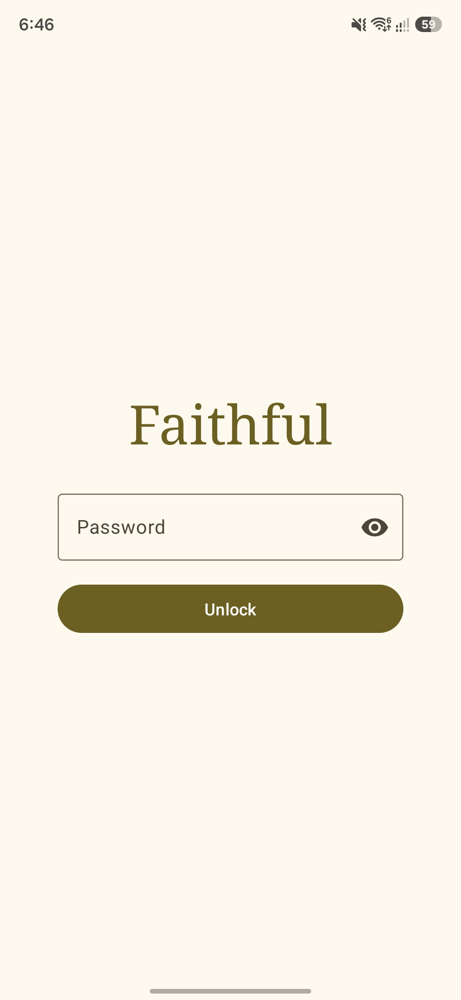
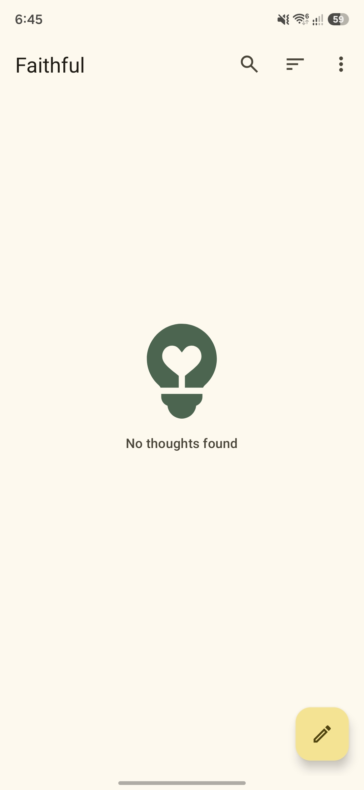
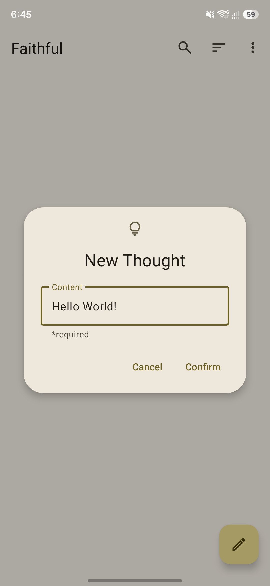
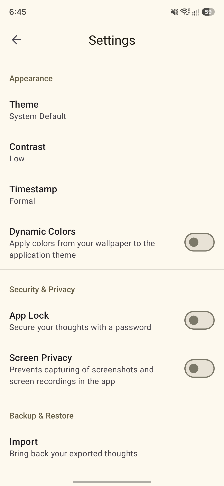

<div align="center">

# 🌷 Faithful

### *A quiet little notebook for the thoughts she'd otherwise forget.*

A private, offline-first Android app I built for someone whose memory works a little like a goldfish's — every fleeting idea, feeling, or reminder lands somewhere safe before it slips away.

</div>

---

## 💛 Why I built this

She forgets things fast. Not in a sad way — just the way a busy mind does when it's holding too much at once. Names of songs she wanted to remember, things she wanted to tell me later, the punchline of a joke she just heard. They evaporate.

So I built her a place that doesn't. A small Android app where she can dump a thought the second it happens — from a notification tile, a home-screen widget, or the app itself — and find it again whenever she wants. Everything stays on her device. There's no signup, no cloud, no account tied to her name. Just her thoughts, and a soft little interface around them.

I picked Java and XML views over Kotlin and Compose on purpose — it's the stack I know best from my coursework, and I wanted to spend my energy on the *feel* of the app instead of fighting a new language.

---

## ✨ Features

### Capture
- 📝 **Quick write** — tap the FAB, type a thought, save. Date and time are stamped automatically.
- ⚡ **Quick Settings tile** — slide down the notification shade, tap the tile, the app opens straight to the "new thought" dialog
- 🏠 **Home-screen widget** — one-tap shortcut from her launcher that also drops her into a new thought
- 💭 *Three entry points so a thought never has to wait for the app to load*

### Find
- 🔍 **Live search** — filters as she types, no submit button
- 📅 **Date filter** — pick any day via a Material date picker; everything else hides until she clears it
- 🔃 **Sort** — newest first or oldest first
- 🌱 **Empty state** — a gentle illustration and a soft line when there's nothing yet

### Privacy & Security
- 🔒 **App lock** — optional PBKDF2-hashed password (10,000 iterations, 256-bit key, per-password random salt)
- ⏱️ **Auto-lock** — re-prompts after 30 seconds of inactivity, app-wide
- 🙈 **Screen privacy mode** — `FLAG_SECURE` hides the app from screenshots, recents previews, and screen recording
- 🛡️ **No cloud, no account** — every thought lives in a local SQLite database, protected only by her device's own storage encryption

### Appearance
- 🎨 **Material 3** with system / light / dark / battery-saving theme
- 🌗 **Contrast variants** — low, medium, and high (proper themed style overlays, not just colors)
- 🌈 **Dynamic colors** — picks up the device's Material You palette on Android 12+
- ⏰ **Two timestamp styles** — friendly ("just now", "2 hours ago") or formal ("11/14/2025 02:30 PM")

### Backup
- 📤 **Export to JSON** — every thought saved into a single file via the system file picker
- 📥 **Import from JSON** — restore from a previous backup (duplicate IDs are skipped, not overwritten, so nothing gets destroyed)

### Little personal touches
- 🌞 **Time-of-day greeting** on the lock screen — morning, afternoon, evening, and midnight, each with their own line
- 🥚 **Easter egg** — tap the app version label seven times to trigger a surprise notification with a random message I wrote just for her

---

## 📸 Screenshots

| Lock | Home | New Thought | Settings |
|:---:|:---:|:---:|:---:|
|  |  |  |  |

---

## ✅ Verification

APK releases on GitHub are signed using my key. They can
be verified using
[apksigner](https://developer.android.com/studio/command-line/apksigner.html#options-verify):

```
apksigner verify --print-certs --verbose faithful.apk
```

The output should look like:

```
Verifies
Verified using v1 scheme (JAR signing): false
Verified using v2 scheme (APK Signature Scheme v2): true
Verified using v3 scheme (APK Signature Scheme v3): false
Verified using v3.1 scheme (APK Signature Scheme v3.1): false
Verified using v3.2 scheme (APK Signature Scheme v3.2): false
Verified using v4 scheme (APK Signature Scheme v4): false
```

The certificate fingerprints should correspond to the ones listed below:

```
Owner: CN=Mowtiie
Issuer: CN=Mowtiie
Serial number: 8a256fdcdde50069
Valid from: Wed Jun 10 22:57:23 PST 2026 until: Sun Oct 26 22:57:23 PST 2053
Certificate fingerprints:
         SHA1: 56:4E:2C:DB:E4:06:C9:EC:15:E6:BC:D9:0A:88:38:72:8B:FB:13:20
         SHA256: 8B:67:51:F3:C3:31:85:63:5F:98:95:30:B6:C0:73:A1:39:7B:3D:41:2B:EF:AE:69:06:A2:EB:58:45:D2:DE:63
```

---

## 🛠️ Tech stack

| Layer | What I used |
|---|---|
| **Language** | Java |
| **UI** | XML views (no Compose) with Material 3 components |
| **Database** | Android SQLite via `SQLiteOpenHelper` |
| **Password hashing** | `PBKDF2WithHmacSHA1`, 10k iterations, 256-bit key, per-password random salt |
| **Quick Settings tile** | `TileService` (API 24+) |
| **Home widget** | `AppWidgetProvider` |
| **Preferences** | `PreferenceManager` + `PreferenceFragmentCompat` |
| **Backup format** | JSON via `org.json` |
| **Min SDK** | 24 (Android 7.0+) |
| **License** | GPL v3.0 |

---

## 🏗️ How it fits together

```
  ┌─────────────────┐  ┌───────────────────┐  ┌────────────────┐
  │   In-app FAB    │  │ Quick Settings    │  │  Home-screen   │
  │  (MainActivity) │  │ tile (TileService)│  │  widget        │
  └────────┬────────┘  └─────────┬─────────┘  └────────┬───────┘
           │                     │                     │
           └─────────────────────┼─────────────────────┘
                                 ▼
                  ┌──────────────────────────────┐
                  │   New-thought dialog         │
                  │   (autofocus + keyboard up)  │
                  └──────────────┬───────────────┘
                                 ▼
                  ┌──────────────────────────────┐
                  │   SQLite (faithful.db)       │
                  │   thoughts table:            │
                  │     • id (UUID)              │
                  │     • content                │
                  │     • timestamp              │
                  └──────────────────────────────┘
```

Every entry point lands in the same place. Everything stays on-device.

---

## 🔐 The app-lock flow

1. She sets a password in Settings → it's salted, PBKDF2-hashed (10k iterations), and only the resulting hash is written to `SharedPreferences`. The plain password is never stored.
2. On every `onResume()`, `FaithfulActivity` (the abstract base every screen extends) checks whether 30 seconds have passed since the last interaction — if so, it boots her to `LockActivity` *before* the screen renders.
3. `LockActivity` runs the entered password through the same PBKDF2 with the stored salt, compares hashes in constant time, and only then routes her back to wherever she was.
4. The Quick Settings tile and home widget go through `SecureActivity` first, which redirects to the lock screen if needed — no entry point skips the check.

If she enables **Screen Privacy**, every activity gets `FLAG_SECURE` on creation — no screenshots, no recents preview, no screen recording. She can show me her phone without showing me her thoughts.

---

## 📁 Project structure

```
app/src/main/java/com/mowtiie/faithful/
├── data/
│   ├── Database.java              # SQLiteOpenHelper, one table: thoughts
│   ├── Theme.java                 # SYSTEM / BATTERY_SAVING / LIGHT / DARK
│   ├── Contrast.java              # LOW / MEDIUM / HIGH
│   ├── Timestamp.java             # DYNAMIC / FORMAL
│   └── thought/
│       ├── Thought.java           # POJO: id, content, timestamp
│       └── ThoughtRepository.java # add, delete, getAll, getByDate
│
├── ui/activities/
│   ├── FaithfulActivity.java      # abstract base: theme + lock + screen privacy
│   ├── SecureActivity.java        # entry router → MainActivity or LockActivity
│   ├── MainActivity.java          # thoughts list, search, filter, sort, new-thought dialog
│   ├── LockActivity.java          # password prompt with time-of-day greeting
│   └── SettingsActivity.java      # preferences + import/export + easter egg
│
├── ui/adapters/
│   └── ThoughtAdapter.java        # RecyclerView adapter with click/delete/share
│
├── service/
│   └── QuickThoughtTileService.java   # QS tile → MainActivity with "QUICK_THOUGHT" extra
│
├── widget/
│   └── QuickThoughtWidget.java        # home-screen widget → same intent
│
└── util/
    ├── SettingUtil.java            # SharedPreferences wrapper
    ├── PasswordUtil.java           # PBKDF2 hash + constant-time verify
    ├── LockUtil.java               # singleton timer for auto-lock
    ├── DateTimeUtil.java           # pretty + formal timestamp formatting
    └── NotificationUtil.java       # easter-egg notification + channel setup
```

---

## 🔧 Setup

1. Clone the repo and open in Android Studio
2. Build and run on a device or emulator (min SDK 24)
3. That's it — no API keys, no Firebase, no signup, no config

If you want the Quick Settings tile, long-press the QS panel after install and drag the **Faithful** tile in. For the home widget, long-press the home screen → **Widgets** → drop **Quick Thought** somewhere.

---

## 🧠 What I learned

- How to build a `TileService` so a thought can be captured without even opening the app — and how the `startActivityAndCollapse` API changed in Android 14 (a `PendingIntent` is required now)
- That `PBKDF2WithHmacSHA1` is good enough for offline-only password protection — *but only* with a per-password random salt and a constant-time hash comparison, otherwise the whole thing is theatre
- `FLAG_SECURE` is one line and shockingly powerful — it disables screenshots, hides the app from recents, and blocks screen recording all at once
- How an abstract base activity (`FaithfulActivity`) can centralize cross-cutting concerns (theme, lock check, screen privacy, notification channels) so individual screens stay focused on what they actually do
- That auto-lock works much better as a singleton timestamp (`LockUtil`) than as per-activity timers — one source of truth, no race conditions when she switches between screens
- How to make `PreferenceFragmentCompat` look and behave like the rest of the app via custom switch widget layouts and Material 3 theming
- That a JSON import that *skips* duplicates is way safer than one that overwrites — backup-restore should never silently destroy data she's added since the last export
- Tiny touches — a time-of-day greeting, a hidden notification — carry surprising emotional weight in a personal app

---

## 👤 Made by

**Her Mowtiie.**

Made with 🌷 so she'd never have to remember alone.
